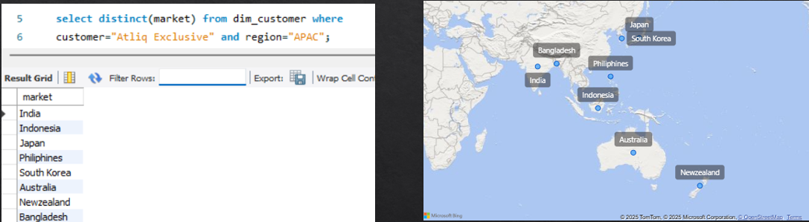
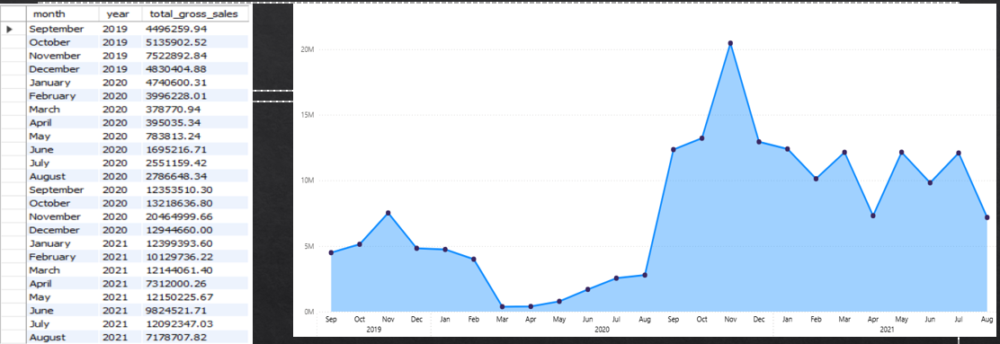
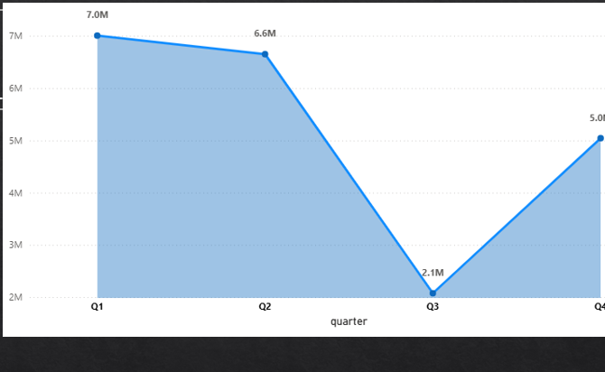

# 📊 SQL-Driven Ad-hoc Business Insights | AtliQ Hardware (FMCG)

    

This Project is a part of Codebasics Resume Project Challenge #4  
This project contains **10 real-world ad-hoc business requests** solved using SQL for **AtliQ Hardware**, a global FMCG company(Imaginery Company).   
The analysis simulates how data analysts answer stakeholder requests and provide **actionable insights**.  

⚠️ **Note:** Raw datasets are confidential and not shared. Only SQL queries, schema documentation, results, and summaries are provided.

---

## 📑 Table of Contents  

- [📌 Project Overview](#-project-overview)  
- [🛠️ Tech Stack](#️-tech-stack)  
- [🔎 Methodology](#-methodology)  
- [📂 Repository Structure](#-repository-structure)  
- [📸 Reports Preview](#-reports-preview)  
- [📈 Key Takeaways](#-key-takeaways)  
- [📈 Key Learnings](#-key-learnings)  
- [🚀 Results Delivered](#-results-delivered)  
- [📑 Deliverables](#-deliverables)  
- [🏁 Conclusion](#-conclusion)  
- [🧑‍💻 Author](#%E2%80%8D-author)  

---

## 📌 Project Overview

Business stakeholders from **Sales, Finance, Marketing, and Supply Chain** raised **10 ad-hoc requests** to address questions such as:
- Which APAC markets should we prioritize for AtliQ Exclusive?  
- How many unique products were launched YoY?  
- Which customers receive the highest discounts?  
- Which channels and products drive most of the sales?  

This project demonstrates how to convert business requests into **SQL queries**, extract insights, and deliver **data-driven recommendations**.

---

## 🛠️ Tech Stack

- **SQL** (MySQL/PostgreSQL) → Querying, joins, aggregations, window functions  
- **Schema Documentation** → Fact & dimension table mapping  
- **Excel / CSV Exports** → Tabular summaries  
- **PowerPoint** → Final presentation (in `reports_data/SQL_DRIVEN_ADHOC_BUSINESS_INSIGHTS.pptx`)  
- **GitHub** → Version control & portfolio hosting  

---

## 🔎 Methodology

The approach followed the **business analytics workflow**:

1. **Understand the request**  
   - Translate stakeholder questions into precise problem statements.  
2. **Explore schema**  
   - Identify required tables (fact & dimension).  
   - Document schema (`schema.md`).  
3. **Write SQL queries**  
   - Each request solved in a separate `.sql` file (`queries `).  
   - Comments explaining objective, inputs, expected output, insights, and recommendations.  
4. **Validate outputs**  
   - Review query results for accuracy (counts, aggregates, consistency).  
5. **Summarize insights**  
   - Convert raw SQL results into business insights (`reports_data/insights_summary.md`).  
6. **Visualize findings**  
   - Build **Power BI visuals** (tables, charts) from SQL outputs.  
7. **Deliver recommendations**  
   - Strategic takeaways compiled into a presentation (`reports_data/SQL_DRIVEN_ADHOC_BUSINESS_INSIGHTS.pptx`).
---

## 📂 Repository Structure  

```text
SQL_Driven_Ad-hoc_Business_Insights/
│
├── queries/                     # Individual SQL files (one per ad-hoc request)
│   ├── 01_apac_exclusive.sql
│   ├── 02_unique_products_yoy.sql
│   ├── 03_products_by_segment.sql
│   ├── ...
│   └── 10_top_products_division.sql
│
├── schema.md
|                  # Database schema documentation
├── result_images/
│   ├── star_schema_atliq.png    # ERD diagram (visual schema)
|   ├── adhoc_1.png              # output visual
|   ├── adhoc_7.png                   :
|   ├── adhoc_8.png              # output visual   
|
├── reports_data/
|   ├── SQL_PROJECT_PPT_ENHANCED.pptx # Presentation with insights
|   ├── insights_summary  # contains all the adhoc_request's objective, insights, recommendation etc
|
└── README.md                    # This file
```

---

## 📸 Reports Preview  

👉 Below are sample visuals created from SQL query outputs (for presentation purposes):  

  
*Ad-hoc_request_1:APAC Markets for "AtliQ Exclusive"*
* Key Insight:
   - Mapped "AtliQ Exclusive" presence across APAC countries to reveal 
     geographic coverage and white-space opportunities.*
* Recommendation:
   - Use findings to guide strategic decisions on strengthening operations 
     and exploring underpenetrated APAC markets.*
---
  
*Ad-hoc_request_7:Monthly Gross Sales for "AtliQ Exclusive"*
*  Key Insight:
   - Sales collapsed during Apr–May 2020 due to COVID disruption.
   - Explosive rebound in Nov 2020 (> $20M) during festive season.
   - FY2021 stabilized at ~$10–13M/month with occasional dips 
     (e.g., Apr 2021 ~$7M), showing resilience but volatility risk.*
* Recommendation:
   - Prioritize Q1 (Sep–Nov) campaigns to maximize festive peaks.
   - Strengthen resilience for Q3/Q4 to mitigate dips.
   - Use post-2020 recovery momentum to drive retention programs
     and explore new APAC market opportunities.*
---
 
*Ad-hoc_request_8:Quarter with Total Sold Quantity (FY2021)*
*Key Insight:
   - Q1 (Sep–Nov 2020) showed the highest sold quantities, 
     driven by festive season demand and recovery momentum 
     after COVID disruptions.  
   - Other quarters remained steady at lower levels, with 
     occasional dips (e.g., Q3 Apr–Jun 2021).*
* Recommendation:
   - Prioritize inventory build-up and marketing spend in Q1.  
   - Explore strategies to boost Q3 demand where volumes dip.  
   - Use seasonal trend data to improve forecasting accuracy.*  

---

## 📈 Key Takeaways

- **APAC Market Expansion:** Regional growth opportunities identified for AtliQ Exclusive.  
- **Portfolio Growth:** Unique product count grew by +36% YoY.  
- **Seasonality:** Clear sales peaks in Q1 (festive season), requiring proactive inventory planning.  
- **Channel Risk:** Over-dependence on Retail channel highlights need for diversification.  

---

## 📈 Key Learnings

- How to **translate vague business questions** into precise SQL queries.  
- Designing **joins, aggregations, CTEs, and window functions** to solve real-world problems.  
- Importance of **clear documentation** and storytelling for stakeholders.  
- Building a complete **end-to-end analytics case study** for portfolio presentation.  

---

## 🚀 Results Delivered

- 10 SQL ad-hoc requests solved with clear documentation.  
- Leadership-level insights on **markets, products, segments, discounts, channels, and divisions**.  
- Recommendations to improve **sales strategy, margin management, and product portfolio balance**.

---

## 📑 Deliverables

- SQL Queries → [`/queries/`](queries)  
- Schema Documentation → [`/data/schema.md`](schema.md)  
- Insights Summary → [`/reports/insights_summary.md`](reports_data/insights_summary.md)  
- Final Presentation → [`/reports/SQL_PROJECT_PPT_ENHANCED.pdf`](reports_data/SQL_DRIVEN_ADHOC_BUSINESS_INSIGHTS.pptx)  

---

## 🏁 Conclusion  

This project demonstrates the end-to-end **business analytics workflow**: from translating stakeholder requests, querying data with SQL, validating outputs, and extracting insights, to creating **Power BI visuals** that highlight Sales and Finance performance.  

By combining **SQL-driven analysis** with clear visual storytelling, the project showcases the ability to:  
- Identify revenue drivers and risks.  
- Quantify performance gaps (e.g., sales growth vs. profit decline).  
- Communicate insights in a way that supports **data-driven decision-making**.  

It highlights strong skills in **SQL, Power BI, and business analytics**, making it a portfolio-ready project for **Data Analyst / BI Analyst roles**.  
👉 This project simulates a real FMCG business scenario, showing how data analysts bridge stakeholder needs with actionable insights.

----

## 🧑‍💻 Author  

**Mohammad Navaman Jamadar**  
*Data Analyst & Machine Learning Practitioner*  
- 📌 Skills: SQL, Power BI, Excel, Python, Data Analysis  
- 🔗 [LinkedIn Profile](https://www.linkedin.com/in/mohammad-navaman-jamadar/) | [GitHub Portfolio](https://github.com/noumanjamadar) | [Portfolio](https://codebasics.io/portfolio/Mohammad-Navaman-Jamadar)

---

