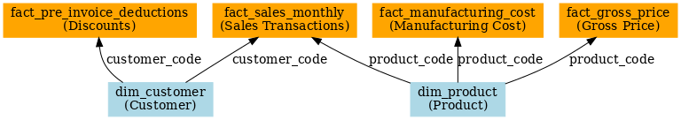

# 📊 Database Schema – AtliQ Business Insights

This schema represents the **Star Schema** used for the SQL-driven Ad-hoc Business Insights Project.  
It consists of **fact tables** (transactions, prices, costs, discounts) and **dimension tables** (customers, products) to enable BI reporting and advanced analytics.  

---

## 🟦 Dimension Tables  

### `dim_customer`  
**Purpose:** Stores customer/account master data including their platform, channel, and geography.  

| Column Name   | Data Type     | Key | Description |
|---------------|--------------|-----|-------------|
| `customer_code` | INT          | PK  | Unique identifier for each customer (Primary Key). Used as FK in `fact_sales_monthly`. |
| `customer`      | VARCHAR(150) |     | Customer name (e.g., Flipkart, Croma, AtliQ Exclusive). |
| `platform`      | VARCHAR(45)  |     | Sales platform type (e.g., Online, Offline, B2B). |
| `channel`       | VARCHAR(45)  |     | Sales channel (e.g., Retail, Distributor, Direct). |
| `market`        | VARCHAR(45)  |     | Market or country (e.g., India, Japan). |
| `sub_zone`      | VARCHAR(45)  |     | Sub-regional classification (e.g., South Asia, Southeast Asia). |
| `region`        | VARCHAR(45)  |     | High-level region grouping (e.g., APAC, EMEA, AMER). |

---

### `dim_product`  
**Purpose:** Stores product master data including categorization and variants.  

| Column Name   | Data Type     | Key | Description |
|---------------|--------------|-----|-------------|
| `product_code` | VARCHAR(45)  | PK  | Unique identifier for each product (Primary Key). Used as FK in `fact_sales_monthly`. |
| `division`     | VARCHAR(45)  |     | High-level grouping of products (e.g., PC, Accessories, Storage). |
| `segment`      | VARCHAR(45)  |     | Sub-group of division (e.g., Networking, Notebooks, Peripherals). |
| `category`     | VARCHAR(45)  |     | Lower-level grouping of products (e.g., Pen Drives, Mouse, Keyboards). |
| `product`      | VARCHAR(200) |     | Product display/marketing name. |
| `variant`      | VARCHAR(45)  |     | Variant details (e.g., 16GB RAM, 512GB SSD, color options). |

---

## 🟧 Fact Tables  

### `fact_sales_monthly`  
**Purpose:** Central transactional table that stores monthly sales data at the customer–product level.  

| Column Name    | Data Type    | Key | Description |
|----------------|-------------|-----|-------------|
| `date`          | DATE        |     | Transaction date (rolled up monthly). |
| `product_code`  | VARCHAR(45) | FK  | Foreign key → `dim_product.product_code`. |
| `customer_code` | INT         | FK  | Foreign key → `dim_customer.customer_code`. |
| `sold_quantity` | INT         |     | Units sold for the given product/customer/date. |
| `fiscal_year`   | YEAR        |     | Fiscal year (Sep–Aug calendar). |

**Joins:**  
- With `dim_product` and `dim_customer` for descriptive info.  
- With `fact_gross_price` → gross sales.  
- With `fact_pre_invoice_deductions` → net sales after discount.  
- With `fact_manufacturing_cost` → profitability.  

---

### `fact_gross_price`  
**Purpose:** Stores product-level gross prices per fiscal year.  

| Column Name   | Data Type      | Key | Description |
|---------------|---------------|-----|-------------|
| `product_code` | VARCHAR(45)   | FK  | Links to `dim_product.product_code`. |
| `fiscal_year`  | YEAR          |     | Fiscal year. |
| `gross_price`  | DECIMAL(15,4) |     | Gross price of the product (per unit, before discounts). |

---

### `fact_manufacturing_cost`  
**Purpose:** Stores product-level manufacturing cost per year.  

| Column Name        | Data Type      | Key | Description |
|--------------------|---------------|-----|-------------|
| `product_code`      | VARCHAR(45)   | FK  | Links to `dim_product.product_code`. |
| `cost_year`         | YEAR          |     | Year of cost record. |
| `manufacturing_cost`| DECIMAL(15,4) |     | Per unit manufacturing cost. |

---

### `fact_pre_invoice_deductions`  
**Purpose:** Stores customer-level pre-invoice discounts per fiscal year.  

| Column Name               | Data Type     | Key | Description |
|----------------------------|--------------|-----|-------------|
| `customer_code`            | INT          | FK  | Links to `dim_customer.customer_code`. |
| `fiscal_year`              | YEAR         |     | Fiscal year. |
| `pre_invoice_discount_pct` | DECIMAL(5,4) |     | Discount percentage applied before invoice. |

---

## 🔗 Schema Relationships (Star Schema)  

- **Fact → Dimension Joins:**  
  - `fact_sales_monthly.customer_code = dim_customer.customer_code`  
  - `fact_sales_monthly.product_code = dim_product.product_code`  
  - `fact_sales_monthly.product_code = fact_gross_price.product_code`  
  - `fact_sales_monthly.product_code = fact_manufacturing_cost.product_code`  
  - `fact_sales_monthly.customer_code = fact_pre_invoice_deductions.customer_code`  

---

## 📊 Star Schema Diagram  

  

---

## 🔍 Analysis Enabled  

This schema enables a wide range of analytics and KPIs for business decision-making:  

- **Sales Performance**  
  - Track sales by customer, product, market, region, and channel.  
  - Monitor monthly, quarterly, and yearly growth trends.  
  - Identify best and worst performing regions or products.  

- **Profitability & Margin Analysis**  
  - Calculate gross margin: `(Gross Price – Manufacturing Cost)`.  
  - Assess impact of discounts on net revenue.  
  - Compare profitability across divisions and customer groups.  

- **Customer Insights**  
  - Identify top customers by sales and volume.  
  - Highlight customers receiving highest discounts (margin erosion risk).  
  - Segment customers by region, platform, and channel for strategic alignment.  

- **Product Insights**  
  - Rank top products by division, segment, or category.  
  - Detect underperforming SKUs for divestment or improvement.  
  - Evaluate product portfolio diversity and growth opportunities.  

- **Strategic Decision Support**  
  - Provide leadership with variance analysis vs. benchmarks.  
  - Support cost optimization and market expansion strategies.  
  - Enable channel diversification and pricing strategy decisions.  

---
